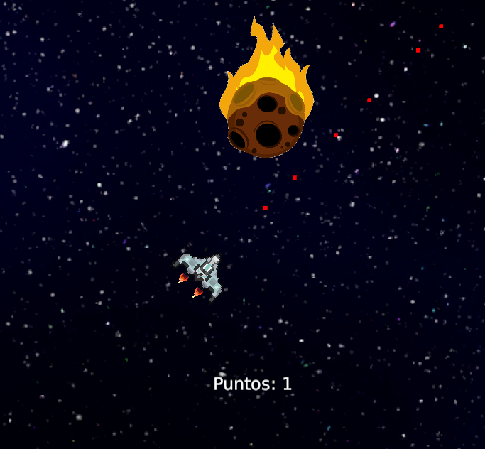

# asteroids

this project is the init assignment for the course "Videogames Fundamentals" @ UPM

consists of a basic implementation of an asteroids game in unity, featuring a bonus implementation of Object Pooling for the bullets

